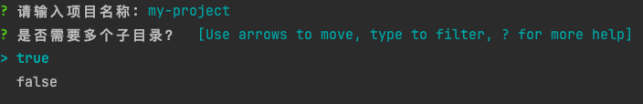

<h1 align="center">gooze-cli</h1>

<p align="center"> 基于 gooze-starter 快速构建 Go 服务 </p>

<p align="center"> 🧠 旨在让 Go 服务的构建「更快、更清晰、更优雅」</p>

可以先去 [gooze-starter 文档中心](https://github.com/soryetong/gooze-starter) 查看文档说明

## 要求

- Go 1.24 或更高版本


## 使用

```bash
go install github.com/soryetong/gooze-cli@latest
```

然后，**进入你想存放的项目的目录中**，运行以下命令：

```bash
gooze-cli init
```

> 如果 `go install` 成功，却提示找不到 `gooze-cli` 命令，那么需要先添加环境变量

运行该命令后，会提示你输入项目名、项目类型等，按照提示输入即可



运行完成后，会按照 Go 社区的项目最佳实践来生成一个优雅的 Go 项目结构，并生成相应的代码文件。

### 关于是否需要多个子目录的解释

当我们在一个项目中同时提供多个独立的 API 服务（管理后台、C端APP、C端Web等），每个端都有自己完整的 API 接口

那么实现方式肯定是 **创建多个子目录**

当这个选择为 `true` 时，目录结构如下
```
my-project/
├── api/                      # API 描述文件目录
│   ├── admin/                # 管理后台端 API 描述
│   │   └── user.api
│   └── client/               # 客户端 API 描述
│       └── user.api
│
├── build/                    # 构建相关脚本（如 Dockerfile、CI 脚本）
│   ├── scripts/              # 启动/部署等辅助脚本（如 build.sh）
│   │   └── gen.sh            # 通用代码生成脚本
│   │   └── gen_*.sh          # 代码生成脚本 *代表对应端 
│   │   └── start_*.sh        # 项目启动脚本 *代表对应端 
│   └── docker/               # Dockerfile 或 compose 文件
│
├── cmd/                      # 每个服务的启动入口
│   ├── admin/                # 管理后台服务入口
│   │   └── main.go
│   └── client/               # 客户端服务入口
│       └── main.go
│
├── configs/                  # 应用级配置（YAML 格式）
│   ├── admin.yaml            # admin 端配置文件
│   └── client.yaml           # client 端配置文件
│
├── docs/                     # 文档入口
│   ├── swagger/              # Swagger 文档
│   │   ├── admin/            # admin 接口文档
│   │   │  └── user.yaml
│   │   └── client/           # client 接口文档
│   │      └── user.yaml
│
├── internal/                 # 核心业务代码（按端划分）
│   ├── admin/                # 管理后台模块
│   │   ├── handler/          # 控制器层（接收请求，返回响应）
│   │   ├── dto/              # 请求/响应的数据结构
│   │   ├── router/           # 路由定义
│   │   ├── service/          # 业务逻辑
│   │   └── bootstrap/        # 启动逻辑
│   └── client/               # 客户端模块（结构同 admin）
│
├── pkg/                      # 可复用公共组件（非业务相关）
│   ├── model/                # 通用数据库模型
│
├── static/                   # 静态资源
│   ├── storage/              # 存放临时文件、用户上传文件、缓存等
│   
├── test/                     # 测试文件（单测、集成测试等）
│
├── .env.admin                # 管理后台的环境变量文件
├── .env.client               # 客户端的环境变量文件
├── .gitignore                # Git 忽略文件
├── go.mod                    # Go 模块定义
├── go.sum                    # Go 依赖校验文件
└── README.md                 # 项目说明文档

```

当这个选择为 `false` 时，目录结构如下

```
my-project/
├── api/                      # API 描述文件（如 user.api）
│   └── user.api
│
├── build/                    # 构建相关脚本（如 Dockerfile、CI 脚本）
│   ├── scripts/              # 启动/部署等辅助脚本（如 build.sh）
│   │   └── gen.sh            # 代码生成脚本
│   │   └── start.sh          # 项目启动脚本
│   └── docker/               # Dockerfile 或 compose 文件
│
├── cmd/                      # 程序入口
│   ├── server/               # 服务入口
│   │   └── main.go
│
├── configs/                  # 应用配置文件
│   └── config.yaml           # 主配置文件（可配合 .env 使用）
│
├── docs/                     # 文档入口
│   ├── swagger/              # Swagger 接口文档
│   │   └── user.yaml
│
├── internal/                 # 核心业务代码（推荐不导出，仅项目内部可用）
│   ├── handler/              # 控制器层（接收请求，返回响应）
│   ├── dto/                  # 请求/响应的数据结构
│   ├── router/               # 路由定义
│   ├── service/              # 业务逻辑
│   └── bootstrap/            # 启动逻辑
│
├── pkg/                      # 可复用公共组件（非业务相关）
│   ├── model/                # 通用数据库模型
│
├── static/                   # 静态资源
│   ├── storage/              # 存放临时文件、用户上传文件、缓存等
│   
├── test/                     # 单元测试 / 集成测试代码
│
├── .env                      # 环境变量文件（用于区分本地/测试/生产）
├── .gitignore                # Git 忽略文件
├── go.mod                    # Go 模块定义
├── go.sum                    # Go 依赖校验文件
└── README.md                 # 项目说明文档
```

可以看到，创建多个子目录，主要是为了分层管理

目录结构没有什么大的差异，只是 `api`、`cmd`、`internal` 多了一个层级


**如果你认为 `gooze-cli` 生成的目录结构你不满意，那你完全可以使用 `gooze-starter` 自行生成**

更多信息，请查看 [gooze-starter 介绍](https://github.com/soryetong/gooze-starter)

<br>

<br>